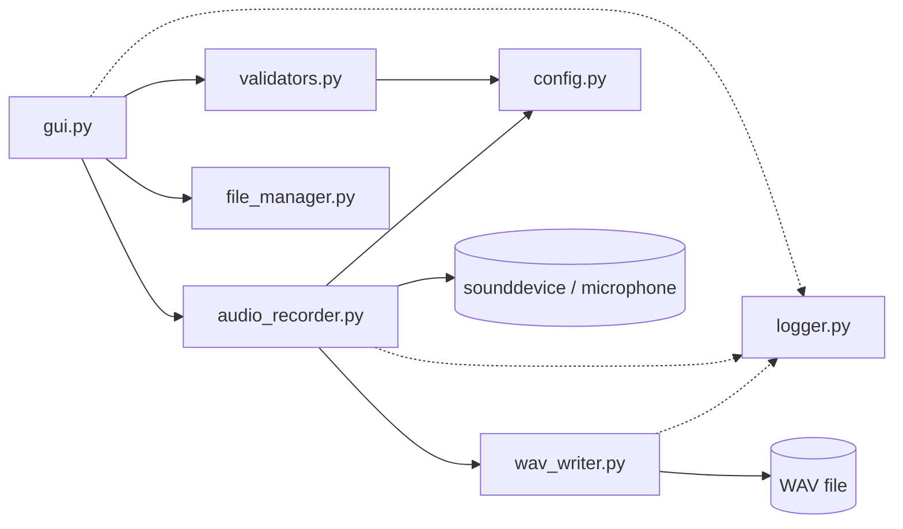
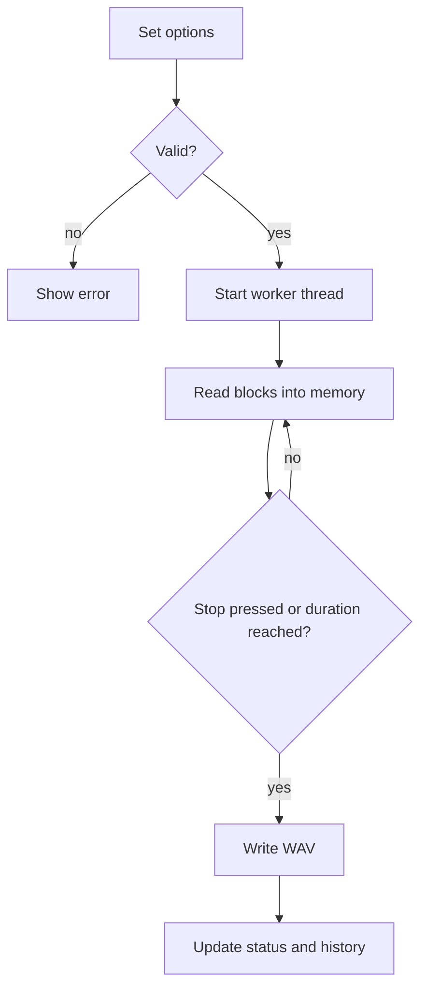
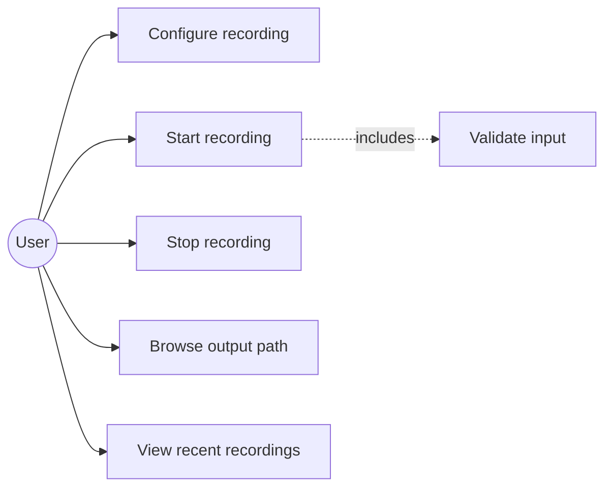
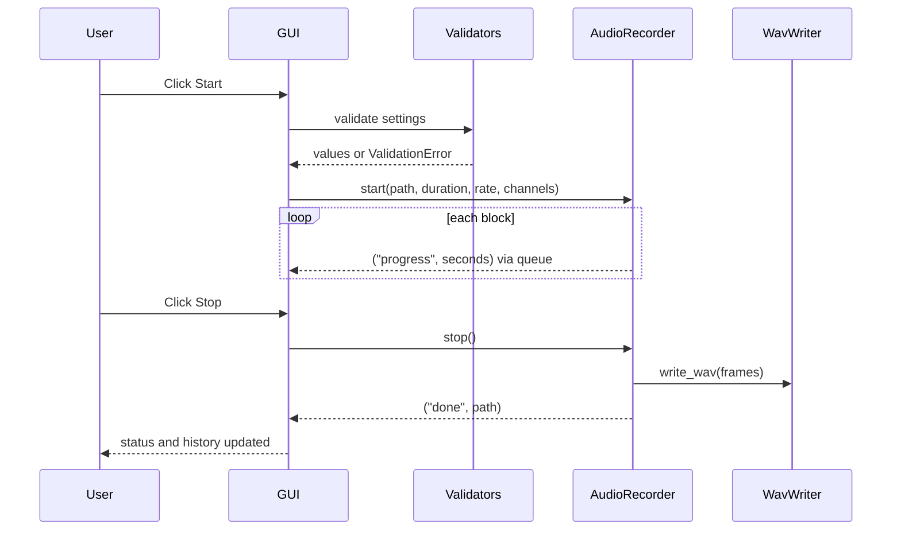
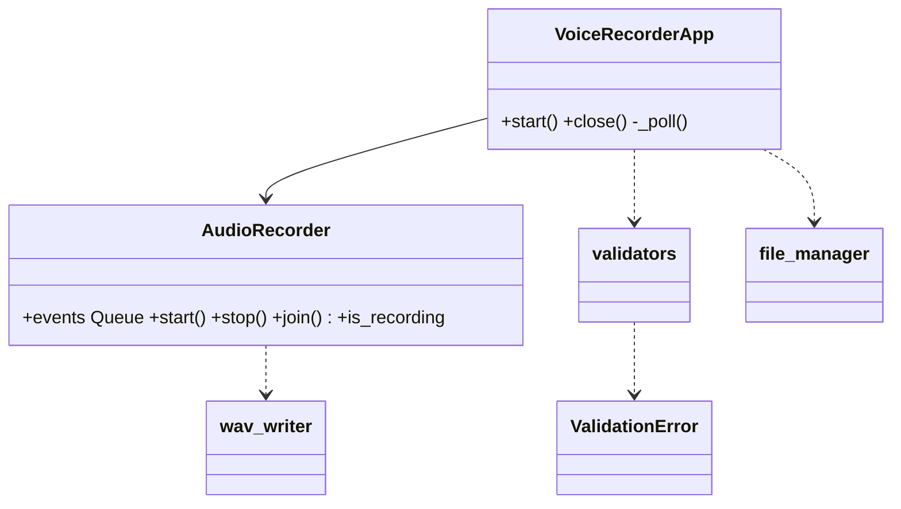

# Architecture and Design Diagrams

## Architecture

## Workflow

## Use Case

## Sequence

## Class Diagram

## Threading Design
The worker thread never touches Tkinter. It posts events to a `queue.Queue`; the GUI polls it every 100 ms with `root.after`.
